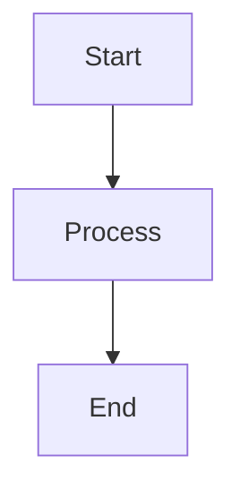

# Phase 3 Features

This note contains all Phase 3 features for E2E verification.

## Callout

> [!note] A sample callout
> This is a callout body with **bold text**.
>
> - List item inside callout
> - Another item

## Math

Inline math: $E = mc^2$

Display math:

$$
\frac{-b \pm \sqrt{b^2 - 4ac}}{2a}
$$

## Mermaid

## Embed

![[linked-note]]

## Block Reference ^ref1

This paragraph has a block reference ID.

Link to the block: [[phase3-test#^ref1]]

Back to [[index]].
